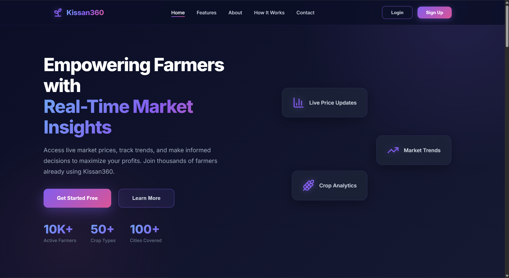
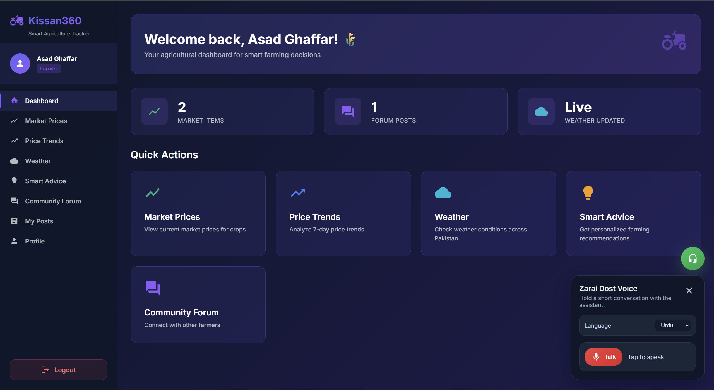
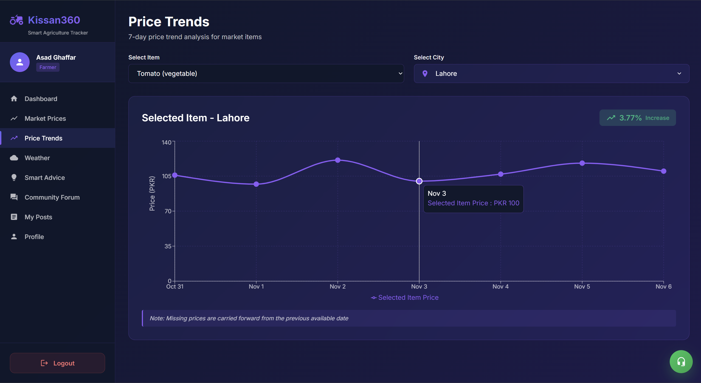
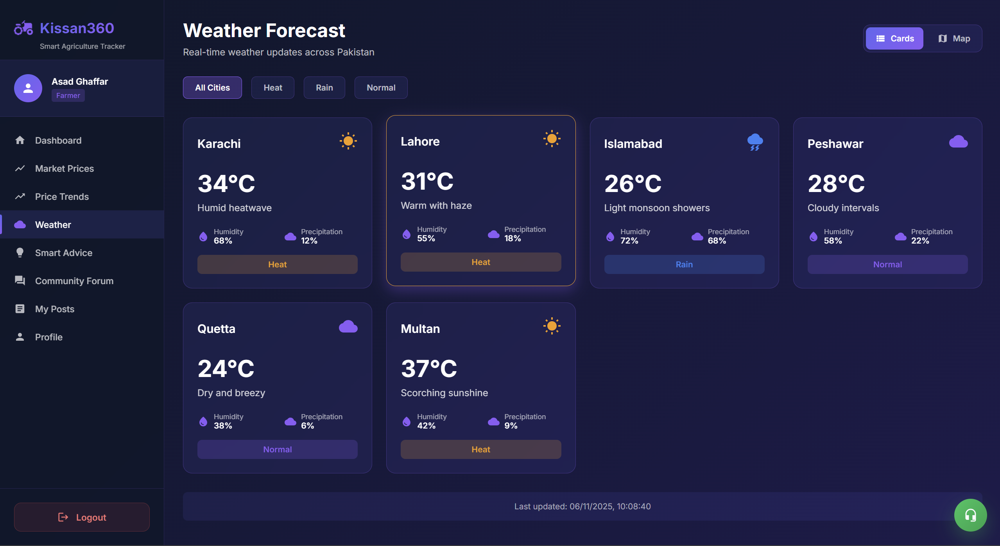

# Kissan360 🌾

**AI-driven farming assistance platform empowering Pakistani farmers with real-time market data, weather insights, and a voice-enabled assistant.**



---

## 📖 Table of Contents

- [Features](#-features)
- [Architecture](#-architecture)
- [Tech Stack](#-tech-stack)
- [Installation](#-installation)
- [Configuration](#-configuration)
- [Usage](#-usage)
- [Contributing](#-contributing)
- [License](#-license)

---

## ✨ Features

Kissan360 bridges the gap between technology and traditional farming with a suite of powerful tools:

- **📊 Real-time Market Intelligence**
  - Track live crop prices across major Pakistani cities.
  - Analyze 7-day price trends with interactive charts.
  - Compare prices to make informed selling decisions.

- **🌦️ Localized Weather Insights**
  - Get precise, agriculture-focused weather forecasts.
  - Receive alerts for rain, heat, and other critical conditions.
  - Visualized on a Pakistan map for easy regional understanding.

- **🤖 AI Smart Advice**
  - Receive actionable recommendations based on real-time market and weather data.
  - Powered by OpenAI to provide context-aware farming tips.

- **🎙️ Urdu Voice Assistant**
  - Speak naturally in Urdu to get answers to your farming questions.
  - Powered by Whisper (STT), GPT-5 (Reasoning), and OpenAI TTS.
  - Accessible directly from the dashboard.

- **👥 Community Forum**
  - Connect with a community of farmers and experts.
  - Share knowledge, ask questions, and discuss agricultural topics.

- **🔐 Role-Based Access**
  - Secure authentication with dedicated dashboards for Farmers and Admins.

---

## 🏗 Architecture

The project is structured as a monorepo with three main components:

```
/
├── backend/             # Node.js/Express API Server
│   ├── controllers/     # Business logic
│   ├── models/          # MongoDB Schemas
│   └── routes/          # API Endpoints
│
├── frontend/            # React/Vite Client Application
│   ├── src/
│   │   ├── components/  # Reusable UI components
│   │   └── pages/       # Application views
│
├── voice-assistant/     # Python/FastAPI Microservice
│   ├── app/             # Voice processing logic
│   └── graph/           # LangGraph workflows
│
└── docs/                # Documentation & Assets
```

---

## 🛠 Tech Stack

- **Frontend:** React, Vite, Material-UI, Recharts, Mapbox GL, Sass
- **Backend:** Node.js, Express, MongoDB, Mongoose, Socket.IO, JWT
- **Voice AI:** Python, FastAPI, LangGraph, OpenAI (Whisper, GPT-4o/5)
- **Tools:** Git, npm, uv (Python package manager)

---

## 🚀 Installation

### Prerequisites
- Node.js (v18+)
- Python (v3.12+)
- MongoDB (Local or Atlas)

### 1. Clone the Repository
```bash
git clone https://github.com/your-username/Kissan360.git
cd Kissan360
```

### 2. Backend Setup
```bash
cd backend
npm install
# Start the server
npm start
```
*Server runs on `http://localhost:8000`*

### 3. Frontend Setup
```bash
cd ../frontend
npm install
# Start the development server
npm run dev
```
*Client runs on `http://localhost:5173`*

### 4. Voice Assistant Setup
```bash
cd ../voice-assistant
# Using uv (recommended) or pip
uv sync
# OR
pip install -e .

# Start the microservice
uvicorn app.main:app --reload --port 8001
```
*Service runs on `http://localhost:8001`*

---

## ⚙ Configuration

Create `.env` files in the respective directories with the following variables:

### Backend (`backend/.env`)
```env
MONGO_URL=mongodb://localhost:27017/kissan360
JWT_SECRET=your_jwt_secret_key
PORT=8000
OPENAI_API_KEY=sk-...
MAPBOX_TOKEN=pk....
VOICE_SERVICE_URL=http://localhost:8001
```

### Voice Assistant (`voice-assistant/.env`)
```env
OPENAI_API_KEY=sk-...
DEFAULT_LANGUAGE=ur
LLM_MODEL=gpt-4o
STT_MODEL=whisper-1
TTS_MODEL=gpt-4o-mini-tts
```

---

## 🖥 Usage

### Farmer Dashboard
Access the comprehensive dashboard to manage your farming activities.


### Market Trends
Analyze price fluctuations to decide the best time to sell.


### Live Weather
Stay updated with real-time weather conditions across the region.


---

## 🤝 Contributing

Contributions are welcome! Please follow these steps:

1. Fork the repository.
2. Create a new branch (`git checkout -b feature/AmazingFeature`).
3. Commit your changes (`git commit -m 'Add some AmazingFeature'`).
4. Push to the branch (`git push origin feature/AmazingFeature`).
5. Open a Pull Request.

---

## 📄 License

This project is licensed under the MIT License - see the [LICENSE](LICENSE) file for details.

